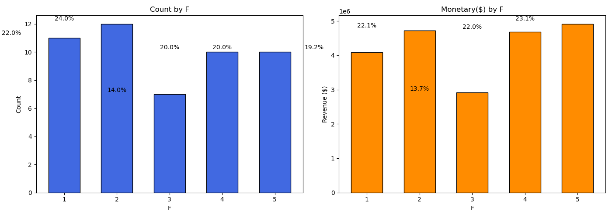

# RFM Analysis

### **Abstract**

RFM analysis, which stands for Recency, Frequency, and Monetary value, is a customer segmentation technique that helps businesses understand and categorize customers based on their purchasing behavior, allowing for more targeted and effective marketing strategies.

Breakdown of RFM Analysis:
<ul>
<li>Recency: How recently a customer made their last purchase.</li>
<li>Frequency: How often a customer makes purchases within a specific timeframe.</li>
<li>Monetary Value: How much a customer spends on average per purchase or over a period.</li>
</ul>

### **Data Processing**

<ol>
<li>Loaded all dependencies/libraries for the data processing</li>
<li>Change data types for CustomerID & Date for further analysis </li>
<li>Extract essential columns for RFM Analysis (OrderNumber, _CustomerID, OrderDate, and Revenue)</li>
<li>Calculate Recency, Frequency, and Monetary for each customer</li>
<li>For recency, using Lambda function to calculate the days since last order (lambda arguments: expression
)</li>
<li>Use qcut method to bin data into equal-sized quantile-based bins and bin method to categorize loyalty group</li>
<li>Import Scikit-learn for machine learning. First, StandarScaler will transfor rfm_dataset features recency, frequency, and monetary to have a mean of 0 and standard deviation of 1. This process will normalize the scale of the features. Then, fit the normalized dataset into Kmean method, which is a unsupervised machine learning algorithm used for clustering. With the elbow curve graph, below I can fine the proper K, The number of clusters.</li>

</ol>

### **Chart and Visualization**
<ol>
<li>Create rfm dataset from the copied dataframe to measure the rfm score for each customer</li>
<li>Segment customers with rfm_score_total (r = recency + f = frequency + m = monetary)</li>
<li>Create two bar charts to visualize the number of customers in each loyalty group category and their corresponding revenue.</li>
<li>Plot the Elbow curve to define the best number of cluster, in this case, it was 3</li>
<li>Plot the Elbow curve to define the best number of cluster, in this case, it was 3</li>
</ol>

### **Analysis**
<ol type="I">
<li>Using the calculated values of recency, frequency, and monetary (Customer LTV), I can assign scores ranging from 1 to 5 to identify customers with high or low recency, frequency, and monetary value. Notably, for recency, a higher score corresponds to lower recency (i.e., more recent customer activity). 

</li>

<li>Categorize customer groups ('Cognitive', 'Affective', 'Conative', 'Action loyalty') based on the combined totals of R, F, and M values.

 
</li>

<li>
Create two bar charts to visualize the count and monetary values categorized by loyalty group. Specifically, the "Conative" group—with an RFM total score ranging between 8 and 12—accounts for 40% of the total customer base and generates 42% of the total revenue. Furthermore, the data reveals a trend indicating that groups with higher RFM scores tend to have greater spending.

 

</li>

<li>
The three pairs of bar charts presented below illustrate the distribution of customer numbers and their corresponding revenue, segmented by recency and frequency. An analysis of the recency pair reveals that customers with a recency score of 2 contributed the second-highest revenue.   
In the pair of frequency charts, an examination reveals that customers with a frequency score of 2 constitute the largest group in terms of customer numbers. However, immediately following this, customers with a frequency score of 3 represent the smallest segment within the frequency-based customer groups

 

</li>

<li>
As the elbow curve line graph shows below, the difference between inertia (also known as the within-cluster sum of squares, which shows the measure of how the points are closer to their centroids, lower inertia indicates the pionts are closer to centroids)

 

Customers in Group II appear to generate more revenue per customer compared to Group I. This suggests that they may be high-value customers making larger or more frequent purchases

</li>

### **Recommendation**
<ol>
<li>The number of cognitive group (10% of tot total customer) is comparavely smaller than other groups. For long term business, I recommend creating campaigns or marketing events to get more new customers  </li>
<li>The road has higher speed limit and normally drivers get into the car accident when they try to pass the yellow light. With that said, shorting the yellow light time would help improve the number of car accident</li>
<li>Consider evaluating the promotions or events that occurred during the period when the recency level reached 2, and explore the potential of implementing a comparable marketing event or promotion to leverage similar customer engagement and revenue outcomes.</li>
<li>Focus on retaining and nurturing high-value customers in Group II to maximize their revenue contribution. </li>
<li>Implement strategies to increase spending among customers in Group I, such as personalized offers or loyalty programs.</li>
<li>Investigate why Group III has a low presence—whether due to churn, lack of engagement, or lower spending behavior—and design strategies to re-engage them</li>
</ol>

### **Conclusion**

In this RFM analysis, I explored two different approaches to segmenting customer groups. The first approach involved manually analyzing key features—recency, frequency, and monetary value—by assigning a 1-5 scale to each. This allowed for a deeper, more detailed dissection of customer groups and provided clear business insights. The second approach utilized clustering, which automatically identified customer segments based on the centroid of each cluster.

Both methods have their advantages and drawbacks. The clustering approach can enhance business performance by uncovering hidden patterns and optimizing segmentation. However, manually analyzing the features provides a more intuitive understanding for business stakeholders, making it easier to interpret the results. Additionally, clustering requires further investigation into why certain groups perform better or worse, whereas manual segmentation offers immediate, straightforward insights.

Another advantage of clustering is its direct application in digital marketing. The segmented customer lists can be leveraged for targeted advertising, and platforms like Meta and Google Ads can use these clusters to find lookalike audiences based on their vast databases. While clustering offers a more automated and scalable solution, the manual approach remains valuable for gaining a clear, human-readable perspective on customer behavior.

